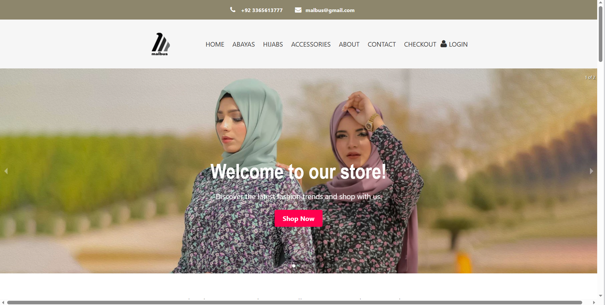
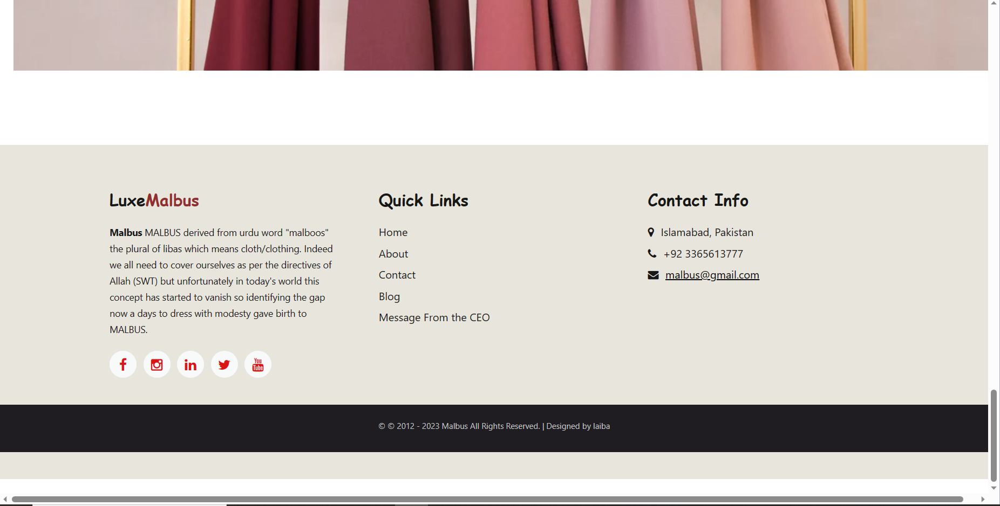

# Abaya & Hijab E-Commerce Shop

## Description

Welcome to our Abaya & Hijab E-Commerce Shop! This project aims to provide a seamless online shopping experience for purchasing abayas and hijabs. Our platform showcases a wide range of high-quality abayas and hijabs, catering to various styles and preferences. Users can browse, select, and purchase products easily through our user-friendly interface.

## Table of Contents

- [Installation](#installation)
- [Usage](#usage)
- [Features](#features)
- [Technologies Used](#technologies-used)
- [Contributing](#contributing)
- [License](#license)

## Installation

Follow these steps to set up the project locally:

1. Clone this repository: `git clone https://github.com/laibabintatahir/my_ecommerce.git`
2. Navigate to the project directory: `cd my_ecommerce`
3. Install dependencies: `npm install`
4. Start the development server: `npm start`
5. Open your web browser and visit: [http://localhost:3000](http://localhost:3000)

## Usage

To explore and shop for abayas and hijabs:

1. Browse through the product categories.
2. Click on a product to view its details.
3. Add products to your shopping cart.
4. Proceed to checkout when ready.

The project offers a smooth shopping experience, allowing users to find their favorite abayas and hijabs with ease.

## Features

- **Product Categories:** Browse abayas and hijabs sorted by categories such as casual, formal, printed, and more.

- **Product Details:** View detailed information about each product, including images, price, and description.

- **Shopping Cart:** Add products to your cart, review your selections, and proceed to checkout.

- **User Accounts:** Create an account to keep track of your orders and save favorite products.

- **Responsive Design:** Enjoy a seamless shopping experience on both desktop and mobile devices.

## Technologies Used

- React
- React Router
- CSS Modules (for styling)

## Contributing

We welcome contributions to enhance our Abaya & Hijab E-Commerce Shop. Here's how you can contribute:

- Follow our coding standards and guidelines when contributing.

## License

This project is licensed under the MIT License.

